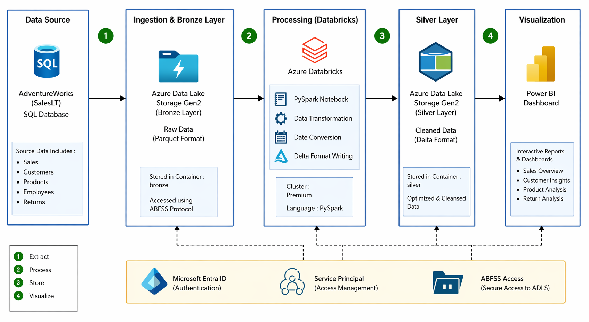
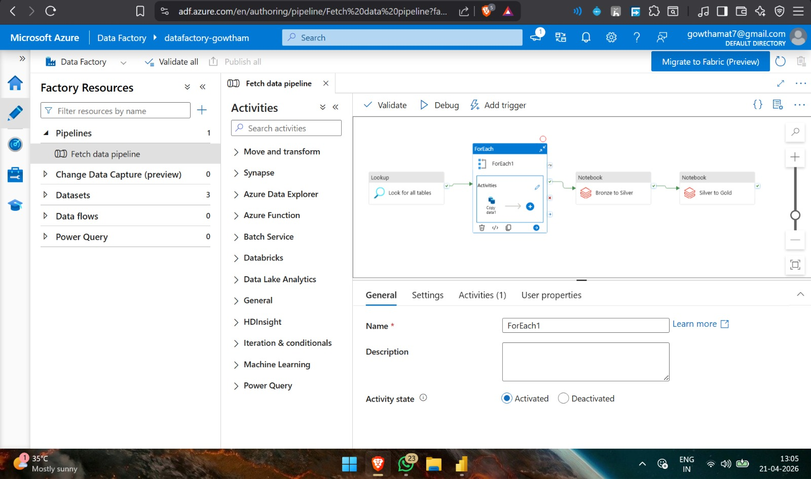
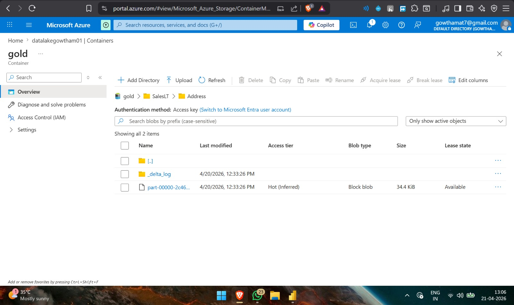
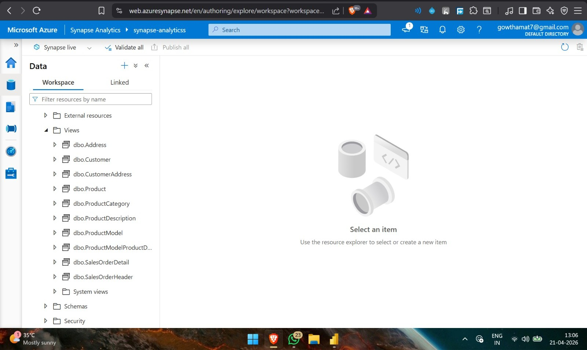

# 🚀 End-to-End Azure Data Engineering Project

## 📌 Project Overview

This project demonstrates an end-to-end Azure Data Engineering pipeline built using Microsoft Azure services. The pipeline extracts data from an Azure SQL Database, ingests it into Azure Data Lake Storage Gen2 using Azure Data Factory, transforms the data using Azure Databricks, creates SQL Serverless Views in Azure Synapse Analytics, and finally visualizes the transformed data using Power BI.

The project follows the Medallion Architecture (Bronze → Silver → Gold) to organize and process data efficiently.

---

# 🏗️ Architecture



---

# 🛠️ Technologies Used

- Azure SQL Database
- Azure Data Factory
- Azure Data Lake Storage Gen2
- Azure Databricks
- Delta Lake
- Azure Synapse Analytics
- Power BI
- SQL
- PySpark

---

# 📂 Project Workflow

### Step 1 - Source Database

- AdventureWorksLT sample database stored in Azure SQL Database.

---

### Step 2 - Data Ingestion

- Azure Data Factory fetches all SalesLT tables.
- Lookup activity retrieves table names.
- ForEach activity copies every table automatically.
- Data is stored inside the Bronze layer in Azure Data Lake Storage Gen2.

---

### Step 3 - Bronze → Silver Transformation

Azure Databricks performs:

- Reads Parquet files from Bronze.
- Identifies Date/Timestamp columns.
- Converts timestamps into `yyyy-MM-dd` format.
- Saves transformed data as Delta Tables in the Silver layer.

---

### Step 4 - Silver → Gold Transformation

Azure Databricks performs:

- Reads Delta tables from Silver.
- Converts PascalCase column names into snake_case.
- Standardizes the dataset.
- Writes clean Delta tables into the Gold layer.

---

### Step 5 - Azure Synapse Analytics

- Serverless SQL Views are created over Gold Delta Tables.
- Views are queried without moving the data.

---

### Step 6 - Power BI

- Power BI connects to Azure Synapse Views.
- Interactive dashboards are built for business reporting.

---

# 📁 Repository Structure

```
Azure-Data-Engineering-Project
│
├── Architecture
├── Azure Data Factory
├── Databricks
├── SQL
├── Synapse
├── Power BI
├── Images
├── README.md
└── LICENSE
```

---

# 📸 Project Screenshots

## Azure Data Factory Pipeline



---

## Azure Data Lake Storage (Gold Layer)



---

## Azure Synapse Analytics



---

## Power BI Dashboard


---

# 📊 Medallion Architecture

```
Azure SQL Database
        │
        ▼
Azure Data Factory
        │
        ▼
Bronze Layer (Raw Data)
        │
        ▼
Azure Databricks
        │
        ▼
Silver Layer (Cleaned Data)
        │
        ▼
Azure Databricks
        │
        ▼
Gold Layer (Business Ready Data)
        │
        ▼
Azure Synapse Analytics
        │
        ▼
Power BI Dashboard
```

---

# 📈 Features

- Automated ingestion using Azure Data Factory
- Medallion Architecture implementation
- PySpark transformations
- Delta Lake storage
- Dynamic table processing
- Azure Synapse Serverless SQL Views
- Interactive Power BI Dashboard

---

# 📌 Future Improvements

- Incremental Data Loading
- CI/CD using Azure DevOps
- Pipeline Monitoring
- Data Quality Validation
- Scheduling with Triggers

---

# 👨‍💻 Author

**Gowtham B**

Azure Data Engineering Project
